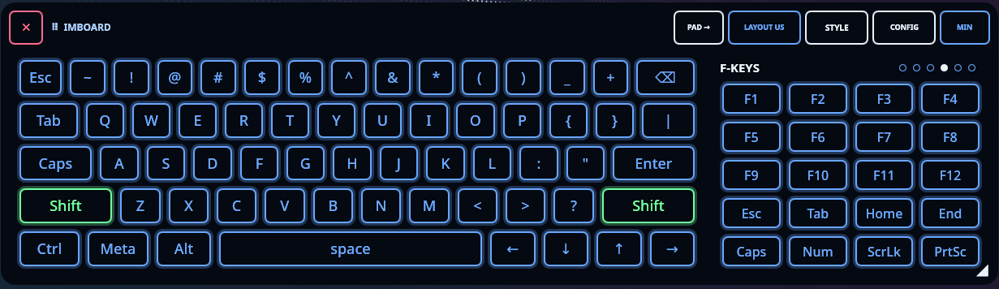
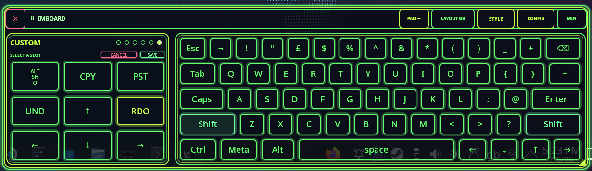
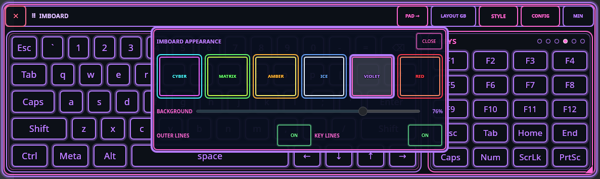
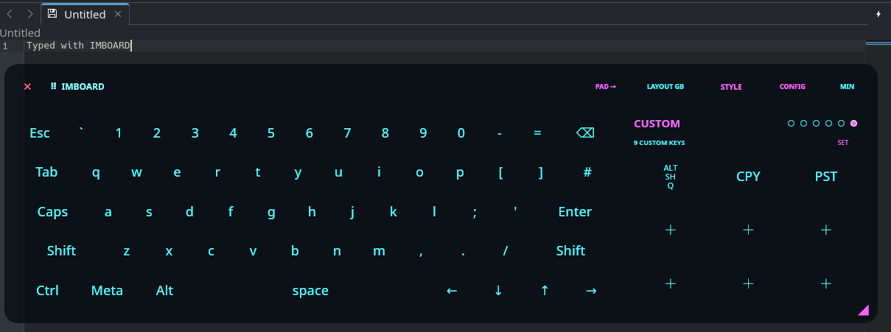

# Imboard

Imboard, short for Input Method Board, is a virtual keyboard for KDE Wayland
desktops. It combines a permanent alphabet board with a
swipeable developer pad for numbers, symbols, navigation, function keys,
shortcuts, and user-defined key actions.

Imboard exists because desktop work on touch-first KDE Wayland systems often
needs keys that are awkward to access consistently on compact on-screen
keyboards: pipes, braces, arrows, function keys, lock keys, and application
shortcuts. It is aimed at scripting, editing, terminal work, and other
developer-heavy desktop tasks.

## Status

Current release target: `0.2.1`.

Imboard presents required keyboard-access setup on first visible launch. The
standard desktop portal grants keyboard-only control and returns a restore token
for later sessions. Imboard remains input-inert until that setup succeeds.
KWin virtual-keyboard registration remains excluded from normal build and
install paths because Imboard uses layer-shell and desktop portals instead.

KDE Wayland is the supported target environment. The current release has been
validated on SteamOS Desktop Mode and Fedora KDE Wayland. Other KDE Wayland
desktops may work if they support layer-shell and the XDG Remote Desktop portal.

## Demo


Higher-quality video: [IMBOARD 0.2.0 walkthrough](docs/videos/imboard-demo-0.2.0.webm)

## Install

IMBOARD is distributed from GitHub releases. I originally intended to publish it
on Flathub, but Flathub's current policy says AI-generated or AI-assisted
applications are not accepted. Rather than ask their reviewers to spend time on
a submission they are likely to reject on policy grounds, IMBOARD is published
here for people who are comfortable installing software outside an app store.

### From A Release Bundle

The easiest install path is the `.flatpak` bundle attached to a GitHub release.
It installs into your user account.

1. Install Flatpak with your distro package manager.

   Fedora:

   ```sh
   sudo dnf install flatpak
   ```

   SteamOS / Arch-like systems usually include Flatpak already. On Arch-like
   systems where it is missing:

   ```sh
   sudo pacman -S flatpak
   ```

2. Download `imboard-0.2.1-x86_64.flatpak` from the GitHub release.

3. Install it:

   ```sh
   flatpak install --user ./imboard-0.2.1-x86_64.flatpak
   ```

4. Launch IMBOARD from the KDE app launcher, or run:

   ```sh
   flatpak run io.github.anicetuscer.imboard --toggle
   ```

The release bundle is currently built for `x86_64`. Users on other
architectures can build from source.

### Build And Install From Source

This path builds a local user Flatpak from a release source checkout. It does
not need root once Flatpak and `flatpak-builder` are installed.

1. Install Flatpak tooling with your distro package manager.

   Fedora:

   ```sh
   sudo dnf install flatpak flatpak-builder
   ```

   Arch-like systems:

   ```sh
   sudo pacman -S flatpak flatpak-builder
   ```

2. Download a GitHub release source archive, unpack it, and enter the source
   directory. Alternatively, clone the repository and check out the release tag:

   ```sh
   git clone https://github.com/AnicetusCer/imboard.git
   cd imboard
   git checkout v0.2.1
   ```

3. Build and install the user Flatpak:

   ```sh
   sh ./scripts/install-user-flatpak.sh
   ```

4. Launch IMBOARD from the KDE app launcher, or run:

   ```sh
   flatpak run io.github.anicetuscer.imboard --toggle
   ```

### Uninstall

Before uninstalling, open IMBOARD's CONFIG panel and use `FORGET ACCESS` if you
want to remove the saved keyboard portal permission cleanly.

Then run:

```sh
sh ./scripts/uninstall-user-flatpak.sh
```

Or uninstall manually:

```sh
flatpak run io.github.anicetuscer.imboard --quit
flatpak uninstall --user --delete-data io.github.anicetuscer.imboard
```

## Security And Permissions

IMBOARD is not signed by a third-party certificate authority and does not have a
third-party security certificate. The trust model is public source, tagged
GitHub releases, local Flatpak builds, documented permissions, and reproducible
validation checks.

The Flatpak does not request network, host filesystem, pointer, touchscreen,
screencast, camera, microphone, or location access. Keyboard events are sent
through the user-approved XDG Remote Desktop portal with keyboard capability.
The portal permission is powerful, so IMBOARD stays input-inert until setup
succeeds and provides a `FORGET ACCESS` flow in CONFIG.

For details, see [Security](SECURITY.md).

## Screenshots









## Product constraints

- Native Wayland and designed for small touch-first KDE desktop displays.
- One compositor-managed transparent surface containing two visual panels.
- A fixed alphabet board and a horizontally swipeable developer pad.
- Configurable actions are data, not shell commands.
- KDE Wayland is the supported target environment.
- Gamescope/Gaming Mode and non-KDE desktops are outside the current project
  scope.

## Developer pad pages

1. Numeric keypad and navigation
2. Common scripting characters
3. Extended characters
4. Function keys
5. Common chords
6. User-assigned text, keys, or chords

## Native Development Build

Imboard requires CMake 3.21+, Qt 6.4+ with Qt Quick and Qt DBus, and Ninja.

```sh
cmake -S . -B build -G Ninja
cmake --build build
ctest --test-dir build
```

Run a development build with:

```sh
timeout --signal=TERM --kill-after=2s 10m ./build/imboard
```

Keys log their requested actions until initial keyboard-access setup succeeds.
After setup, later launches automatically attempt to restore the saved portal
session; CONFIG exposes READY or REPAIR status rather than an input off switch.

Only one Imboard instance can run. A second launch asks the existing window to
show instead of creating another process. A reliable external shutdown path is:

```sh
./build/imboard --quit
```

Emoji tooltip artwork is from [Twemoji](https://github.com/twitter/twemoji),
used unmodified under CC BY 4.0. The bundled graphics licence is at
`assets/twemoji/LICENSE-GRAPHICS`. Emoji and other non-ASCII text input are
experimental and disabled by default because the current fallback temporarily
uses the clipboard before sending `Ctrl+V`, then attempts to restore the
previous clipboard text.

Regional main-keyboard layouts are JSON resources. Imboard includes common
English QWERTY regional choices and behaves like a physical keyboard: choose the
layout that matches the current KDE or SteamOS system keyboard layout. See
[Adding keyboard layouts](docs/keyboard-layouts.md) for the extension schema.

The local Flatpak development manifest and test procedure are described in
[Flatpak development build](docs/flatpak-development.md).

Flathub submission preparation is tracked in
[Flathub submission path](docs/flathub-submission.md).

Release validation is tracked in [Release checklist](docs/release-checklist.md).

Contributor and AI-maintainer guidance starts in [AGENTS.md](AGENTS.md). The
current component ownership and runtime flow are documented in
[Code map](docs/code-map.md).

## Known limitations

- Gamescope/Gaming Mode support is not targeted.
- Emoji and non-ASCII text input are experimental and app-dependent.
- The keyboard uses the XDG Remote Desktop portal because Wayland correctly
  blocks ordinary apps from injecting input into other apps without permission.
- Portal permission wording varies by desktop and may mention Input Device,
  Remote Desktop, or Remote Control even though Imboard requests keyboard
  capability only.
- The selected Imboard layout must match the desktop keyboard layout for shifted
  symbols to match the key labels.
- Non-KDE Wayland desktops are not supported targets. Imboard shows a one-time
  compatibility note if launched outside KDE.

## Maintenance and support

Imboard is a spare-time project. Bug reports, focused pull requests, and KDE
Wayland test results are welcome. If Imboard saves you time and you want to
support the work, Ko-fi donations are welcome at
<https://ko-fi.com/anicetuscer>.

## Licence and branding

Imboard is free software licensed under GPL-3.0-or-later; see [LICENSE](LICENSE).

The Imboard name and official branding identify the upstream project. Modified
redistributions must not imply that they are official Imboard releases unless
that use has been approved. See [Imboard name and branding](TRADEMARKS.md).

## Roadmap

- [x] Safe movable/resizable window lifecycle harness
- [x] Nine-key programmable bank with transactional Set mode
- [x] Swipeable developer pad with numeric, code, F-key and combo pages
- [x] Add touch-friendly custom-key picker categories
- [x] Add persistent regional keyboard layout selection
- [ ] Refine custom-key picker touch feedback
- [x] Text and single-key injection through the keyboard-only portal session
- [x] Press/release modifier state and chords
- [x] Manual system-tray show/hide control
- [x] Editable user page with validated persistent configuration writes
- [x] Flatpak-compatible run-at-login through the Background portal
- [x] Flatpak packaging and SteamOS integration tests
- [x] Fedora KDE Wayland validation

## Safety

Do not add `X-KDE-Wayland-VirtualKeyboard=true` to an Imboard desktop entry or
enable KWin virtual-keyboard autoload. Imboard is a layer-shell client and uses
the desktop portal for input; it is not a KWin input-method plugin.
